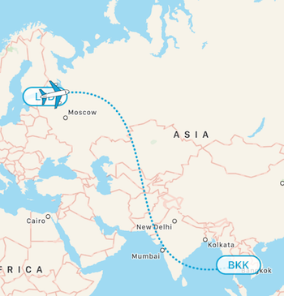
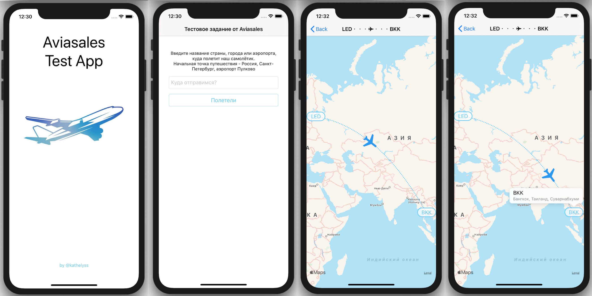

# AviaTales

Тестовое задание от Aviasales :)

## Формулировка

Реализовать приложение, состоящее из двух экранов:
1) Экран выбора аэропорта с полем ввода названия города.
Дизайн экрана — на усмотрение разработчика.
Серверный API, [пример запроса](http://places.aviasales.ru/places?term=париж&locale=ru).
2) Экран отображения анимации полёта самолётика между Санкт-Петербургом и выбранным аэропортом/городом.
- В минимальном варианте форма пути - геодезическая прямая, дополнительным плюсом будет форма пути в соответствии с референсом (картинка ниже). В остальном результат должен быть близок к дизайну по внешнему виду.
- Самолётик должен лететь плавно (в том числе при манипуляциях с картой).
- При смещении карты самолётик и путь не должны смещаться относительно карт.
- В качестве иконки самолётика использовать приложенный plane.pdf.

Задание предлагается выполнить полностью на Swift и должно поддерживать версии iOS 12 и выше.

## Результат

